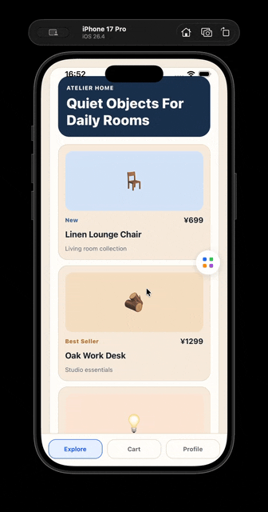

# React Native Debug Toolkit



[中文](README.zh-CN.md)

React Native Debug Toolkit is a dev-only local debugging toolkit for React Native apps.

Use it to inspect app logs on device, stream logs to a desktop Web Console, and let AI coding agents read real runtime evidence through HTTP or MCP.

```text
RN App -> Debug Panel -> local daemon -> Web Console / HTTP API / MCP
```

## What You Get

- In-app debug panel with Network, Console, Navigation, Track, Zustand, Environment, and Clipboard logs.
- Desktop Web Console for simulator and real-device logs.
- Local HTTP API for curl, scripts, Codex, Claude Code, and other AI agents with shell access.
- Optional MCP server with `list_app_devices` and `get_app_logs`.
- Local-first workflow. No cloud service. No AI API call inside the package.

## Install

```bash
npm install react-native-debug-toolkit
```

Optional dependencies:

```bash
npm install @react-native-clipboard/clipboard
npm install @react-native-async-storage/async-storage
```

## Quick Start

Wrap your app:

```tsx
import { DebugView } from 'react-native-debug-toolkit';

export function App() {
  return (
    <DebugView>
      <AppContent />
    </DebugView>
  );
}
```

Run the app in dev mode, then tap `DBG`.

Start the desktop daemon:

```bash
npx debug-toolkit --daemon-only
```

Open the Web Console:

```text
http://127.0.0.1:3799/console
```

In the app, open Debug Panel -> gear -> `Send Once` or `Start Live Sync`.

## Device Setup

| Runtime | App endpoint |
| --- | --- |
| iOS simulator | `http://localhost:3799` |
| Android emulator | `http://10.0.2.2:3799` |
| Real device | `http://<mac-ip>:3799` |

For a real device, first open this URL in the phone browser:

```text
http://<mac-ip>:3799/health
```

If it does not open, check Mac firewall, Wi-Fi isolation, VPN, local network permission, and cleartext HTTP settings.

The daemon stores logs at:

```text
~/.react-native-debug-toolkit/daemon-devices.json
```

Custom store path:

```bash
npx debug-toolkit --daemon-only --store /path/to/devices.json
DEBUG_TOOLKIT_DAEMON_STORE=/path/to/devices.json npx debug-toolkit --daemon-only
```

## Read Logs With HTTP

HTTP is the best path when your AI agent or script has shell access.

```bash
BASE=http://127.0.0.1:3799

curl "$BASE/health"
curl "$BASE/devices"
curl "$BASE/devices/latest"

DEVICE_ID=$(curl -s "$BASE/devices" | node -e "let s='';process.stdin.on('data',d=>s+=d).on('end',()=>console.log((JSON.parse(s).devices||[])[0]?.deviceId||''))")

curl "$BASE/devices/$DEVICE_ID/logs?limit=100"
curl "$BASE/devices/$DEVICE_ID/logs?type=network&failedOnly=true&limit=50"
curl "$BASE/devices/$DEVICE_ID/logs?type=console&limit=100"
curl "$BASE/devices/$DEVICE_ID/logs?entryId=<entryId>"
curl "$BASE/devices/$DEVICE_ID/logs?limit=100&includeBodies=true"
curl -X DELETE "$BASE/devices"
```

Main endpoints:

```text
GET    /health
POST   /report
POST   /ingest
GET    /devices
GET    /devices/latest
GET    /devices/:deviceId
GET    /devices/:deviceId/logs?type=&limit=&failedOnly=&includeBodies=&entryId=
DELETE /devices
GET    /events
GET    /console
```

## Use MCP

```bash
claude mcp add debug-toolkit -- npx debug-toolkit
```

Tools:

- `list_app_devices`
- `get_app_logs`

`get_app_logs` excludes bodies by default to reduce tokens. Set `includeBodies=true` or pass `entryId` to fetch one full log entry.

## App Options

Disable features:

```tsx
<DebugView features={{ clipboard: false, zustand: false }}>
  <AppContent />
</DebugView>
```

Navigation tracking:

```tsx
<DebugView navigationRef={navigationRef}>
  <NavigationContainer ref={navigationRef}>
    <AppContent />
  </NavigationContainer>
</DebugView>
```

Zustand:

```tsx
import { zustandLogMiddleware } from 'react-native-debug-toolkit';
```

Track:

```tsx
import { addTrackLog } from 'react-native-debug-toolkit';

addTrackLog({ eventName: 'button_click' });
```

## Exports

- `DebugView`
- `DebugToolkit`
- `initializeDebugToolkit`
- `createDebugDeviceReport`
- `checkDaemonConnection`
- `reportDebugDeviceToDaemon`
- `startStreaming`
- `stopStreaming`
- `isStreaming`
- `autoDetectDaemonIp`
- feature factories and types

## Limits

- Dev tool, not production monitoring.
- Local daemon, not cloud replay.
- Network capture observes traffic; it does not analyze auth, tokens, or business errors.
- No default redaction.
- Not a React Native DevTools replacement.

## License

MIT
