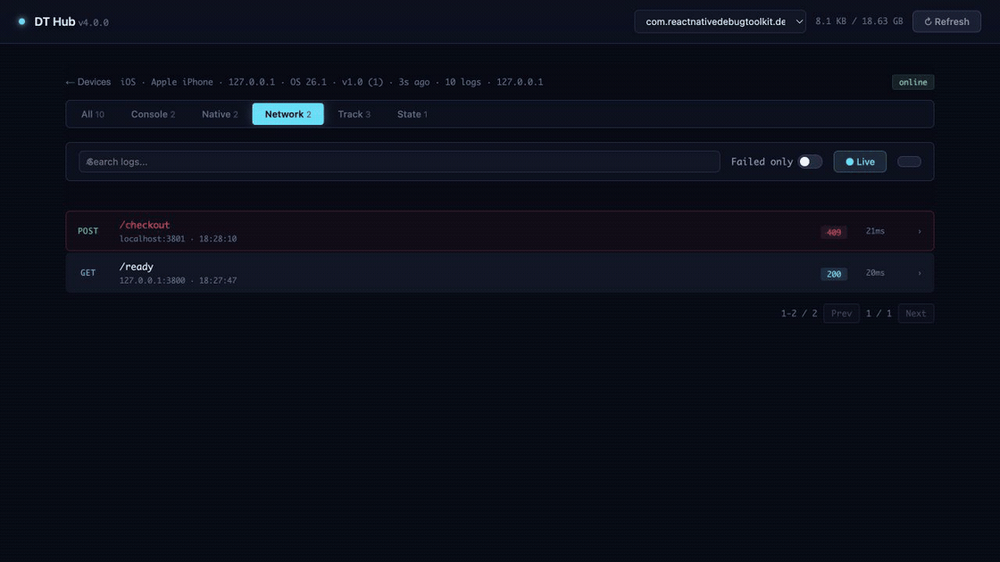

# React Native Debug Toolkit

**Debug in your app. Inspect in your browser. Give your AI the runtime evidence.**

[中文](README.zh-CN.md) · [Demo](Demo/README.md) · [Setup](docs/setup.md) · [Feature examples](docs/usage.md)

- **In-app inspector:** requests, logs and state changes in a floating panel.
- **Local Hub:** live device logs, search and request details in your browser.
- **AI workflow:** a repository Skill lets your coding assistant read runtime evidence and trace it to code. No MCP setup.

<p align="center"></p>

## Quick start

Install, then rebuild your native app:

```sh
npm install react-native-debug-toolkit
cd ios && pod install
```

Wrap your existing root component and set a stable `appId`:

```tsx
import { DebugView } from 'react-native-debug-toolkit';

export default function App() {
  return (
    <DebugView features={{ devConnect: { appId: 'com.example.myapp' } }}>
      <AppContent />
    </DebugView>
  );
}
```

Tap the floating launcher to inspect. Expo requires a development build; Expo Go is not supported.

## Connect your browser and AI

From your app project, start the Hub:

```sh
npx --package=react-native-debug-toolkit debug-toolkit hub dev
```

Open [localhost:3800](http://127.0.0.1:3800/). Debug builds discover the Hub through Metro and upload automatically. For physical devices, use your computer's reachable LAN address.



Install the AI Skill once:

```sh
npx --package=react-native-debug-toolkit debug-toolkit init
```

Commit the generated Skill and `AGENTS.md` changes. In a coding assistant that loads them, reproduce the issue and ask:

> Check why the checkout just failed. Use the runtime logs to locate the relevant code.

## More tools

[Feature examples](docs/usage.md): Zustand state, navigation, events, environments, test accounts, retained sessions and custom tabs.

[Run the Demo](Demo/README.md) to try a real HTTP 409 → 201 flow with synthetic shop data.

Use in debug/internal builds. Release uploads require an explicit action in Connect. Keep public production builds disabled and the Hub on a trusted network; logs are not automatically redacted. [Configuration & troubleshooting](docs/setup.md) · [MIT](LICENSE)
