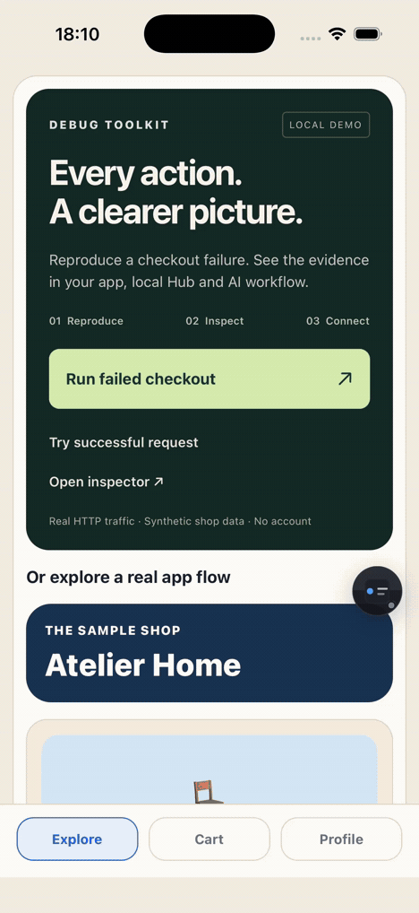

# React Native Debug Toolkit



[中文](README.zh-CN.md)

> **v4 is a breaking Shared Log Hub release.** The old per-developer daemon,
> `/report`/`/ingest` endpoints and v3 MCP workflow are removed. The legacy
> material below is retained only for unrelated Toolkit features; do not use
> its daemon commands.

## v4 Shared Log Hub

One Mac mini runs the Hub; each debug/internal-test App uploads to its fixed
LAN address. Day-to-day users only run the App and ask their repository AI to
diagnose a runtime problem — MCP is optional.

### 1. Install the Hub once (Mac mini)

Use a fixed package version and the Mac mini's fixed LAN IP:

```bash
npm exec --yes --ignore-scripts --omit=peer \
  --package=react-native-debug-toolkit@4.0.0 -- \
  debug-toolkit hub install --system \
  --bind 10.20.4.10 \
  --advertise-url http://10.20.4.10:3799
```

`hub install --system` creates a LaunchDaemon, so the service comes back after
reboot without a login. It stores data under
`/Users/Shared/ReactNativeDebugToolkitHub/data`; retention is seven days and
the Hub stops accepting new events at 20 GB. Keep the address on a trusted
LAN/VPN only: logs are isolated by app, not confidential.

The current minimal installer copies the bootstrap Node 20+ executable into
the versioned runtime. It deliberately has no hidden download step; install it
from the target Mac mini and re-run with `--replace` when changing the package
version.

For a no-write check of the generated paths and LaunchDaemon settings:

```bash
debug-toolkit hub install --system --dry-run \
  --bind 10.20.4.10 --advertise-url http://10.20.4.10:3799
```

### 2. Connect an App once

Use the existing `DebugView → features.devConnect` configuration; do not add a
separate config file or persist a device-specific IP.

```tsx
<DebugView
  enabled={__DEV__ || appConfig.buildChannel === 'internal'}
  features={{
    console: true,
    network: true,
    devConnect: {
      appId: appConfig.appId,
      endpoint: 'http://10.20.4.10:3799',
    },
  }}
>
  <AppContent />
</DebugView>
```

Production builds must set `enabled={false}`. In bare React Native, add iOS
Local Network/ATS and Android cleartext exceptions only to debug/internal build
variants; Expo Go is unsupported (use a development build or prebuild).

The v4 DevConnect tab has only a Hub-address input, **Sync Now** (with a short
session code) and pause/resume. The address override lasts only for the current
runtime; clearing it restores the configured Hub.

### 3. Let repository AI read logs

Generate and commit the repository Skill from the App workspace:

```bash
npm exec --no --package=react-native-debug-toolkit -- debug-toolkit init-skill
```

The Skill runs `status → context → inspect` over the Hub HTTP API. It asks the
user for the short code shown by **Sync Now**, records that Session's sync
baseline, and only then asks them to tap the button. This prevents an AI from
reading a colleague's active Session by mistake. The local AI shell must be on
the same LAN/VPN and able to reach the Hub.

Manual read-only commands always use explicit values:

```bash
debug-toolkit status --endpoint http://10.20.4.10:3799 --app-id com.example.app
debug-toolkit context --endpoint http://10.20.4.10:3799 --app-id com.example.app --session <session-id>
```

## Legacy v3 documentation (obsolete; do not follow its daemon/MCP commands)

A local debugging toolkit for React Native apps. It provides an in-app debug panel, a desktop Web Console, an HTTP API, and an MCP server — all running locally with no cloud dependency.

```text
RN App -> Debug Panel -> local daemon -> Web Console / HTTP API / MCP
```

## Features

- In-app debug panel: Network, Console, Native, Navigation, Track, Zustand, Environment, Clipboard, and custom tabs.
- Desktop Web Console for viewing simulator and real-device logs in a browser.
- Local HTTP API for reading logs with `curl`, scripts, or AI agents (Codex, Claude Code, etc.).
- Optional MCP server exposing `list_app_devices` and `get_app_logs`.
- Local-first: no cloud service, no signup, no AI API calls inside the package.

## Install

```bash
npm install react-native-debug-toolkit
```

Install the native part and rebuild:

```bash
cd ios && pod install
# Android: Gradle autolinking runs on the next build
```

Expo Go cannot load this native module. Use a development build, prebuild, or bare React Native app.

Optional dependencies:

```bash
npm install @react-native-clipboard/clipboard
npm install @react-native-async-storage/async-storage
```

## Quick Start

Wrap your app:

```tsx
import { DebugView } from 'react-native-debug-toolkit';

export function App() {
  return (
    <DebugView>
      <AppContent />
    </DebugView>
  );
}
```

Run the app in dev mode, then tap `DBG`.

Start the desktop daemon:

```bash
npm exec -- debug-toolkit --daemon-only
# or: npx react-native-debug-toolkit --daemon-only
```

Open the Web Console:

```text
http://127.0.0.1:3799/console
```

In the app, go to Debug Panel → `DevConnect` → `Send Once` or `Start Live Sync` to sync logs to the desktop.

DevConnect auto-detects simulator/emulator and configures host settings. On real devices, enter your computer IP manually.

IP and ports are persisted via AsyncStorage (when installed) or through the native module after rebuild.

QR scan is optional. Install `react-native-camera-kit` or `expo-camera` to enable the scan button. The app must request camera permission before scanning.

## Device Setup

| Runtime | App endpoint |
| --- | --- |
| iOS simulator | `http://localhost:3799` |
| Android emulator | `http://10.0.2.2:3799` |
| Real device | `http://<mac-ip>:3799` |

For real devices, first open this URL in the phone browser:

```text
http://<mac-ip>:3799/health
```

If it does not open, check Mac firewall, Wi-Fi isolation, VPN, local network permission, and cleartext HTTP settings.

Daemon log store:

```text
~/.react-native-debug-toolkit/daemon-devices.json
```

Custom store path:

```bash
npm exec -- debug-toolkit --daemon-only --store /path/to/devices.json
# or: npx react-native-debug-toolkit --daemon-only --store /path/to/devices.json
DEBUG_TOOLKIT_DAEMON_STORE=/path/to/devices.json npm exec -- debug-toolkit --daemon-only
```

## Read Logs With HTTP

HTTP is the recommended path when your AI agent or script has shell access.

```bash
BASE=http://127.0.0.1:3799

curl "$BASE/health"
curl "$BASE/devices"
curl "$BASE/devices/latest"

DEVICE_ID=$(curl -s "$BASE/devices" | node -e "let s='';process.stdin.on('data',d=>s+=d).on('end',()=>console.log((JSON.parse(s).devices||[])[0]?.deviceId||''))")

curl "$BASE/devices/$DEVICE_ID/logs?limit=100"
curl "$BASE/devices/$DEVICE_ID/logs?type=network&failedOnly=true&limit=50"
curl "$BASE/devices/$DEVICE_ID/logs?type=console&limit=100"
curl "$BASE/devices/$DEVICE_ID/logs?entryId=<entryId>"
curl "$BASE/devices/$DEVICE_ID/logs?limit=100&includeBodies=true"
curl -X DELETE "$BASE/devices"
```

Endpoints:

```text
GET    /health
POST   /report
POST   /ingest
GET    /devices
GET    /devices/latest
GET    /devices/:deviceId
GET    /devices/:deviceId/logs?type=&limit=&failedOnly=&includeBodies=&entryId=
DELETE /devices
GET    /events
GET    /console
```

## Use MCP

```bash
claude mcp add debug-toolkit -- npm exec -- debug-toolkit
# or: claude mcp add debug-toolkit -- npx react-native-debug-toolkit
```

Tools:

- `list_app_devices` — list connected devices
- `get_app_logs` — fetch device logs

`get_app_logs` excludes bodies by default to reduce token usage. Set `includeBodies=true` or pass `entryId` to fetch a single full entry.

## Native Logs

Native Logs collects native app-process logs and displays them in the `Native` tab.

- Android: captures current app-process `logcat` entries visible to the app.
- iOS: captures React Native native logs emitted through `RCTLog*`.
- DevConnect sends Native logs to the desktop daemon with the rest of the current session.

Release builds stay disabled by default. To enable for internal release, TestFlight, QA, or gray rollout builds:

```tsx
<DebugView enabled={true} />
```

Native logs may contain user data, tokens, URLs, or device state. Do not enable by default in public production builds.

## App Options

### Environment switching

Use object-form `environments` when an app needs in-app runtime environment switching.

```tsx
import { DebugView, type DebugEnvironment } from 'react-native-debug-toolkit';

async function applyEnvironment(env: DebugEnvironment) {
  configureApiClients(env.urls);
  queryClient.clear();
  await authStorage.clearTokens();
  signOut();
}

<DebugView
  environments={{
    defaultId: 'prod',
    items: [
      {
        id: 'prod',
        label: 'Production',
        urls: {
          auth: 'https://api.auth.example.com',
          app: 'https://api.app.example.com',
          shop: 'https://api.app.example.com/shop',
        },
      },
      {
        id: 'qa',
        label: 'QA',
        urls: {
          auth: 'https://qa-auth.example.com',
          app: 'https://qa-app.example.com',
          shop: 'https://qa-app.example.com/shop',
        },
      },
    ],
    onChange: applyEnvironment,
  }}
>
  <AppContent />
</DebugView>
```

The toolkit persists the selected environment, shows it in the `Environment` tab and launcher badge, and rewrites outgoing network URLs from the default environment URL prefixes to the selected environment URL prefixes.

Host apps with cached API clients, query caches, auth tokens, or router state should reset those resources in `onChange`. Treat environment switching as a session boundary.

### Disable features

```tsx
<DebugView features={{ clipboard: false, zustand: false }}>
  <AppContent />
</DebugView>
```

### Custom tabs

```tsx
import {
  DebugView,
  createDebugTab,
  type DebugFeatureRenderProps,
} from 'react-native-debug-toolkit';

type UserSnapshot = {
  id?: string;
  role?: string;
};

function UserDebugTab({ snapshot }: DebugFeatureRenderProps<UserSnapshot>) {
  return (
    <View>
      <Text>User ID: {snapshot.id ?? '-'}</Text>
      <Text>Role: {snapshot.role ?? '-'}</Text>
    </View>
  );
}

const userDebugTab = createDebugTab<UserSnapshot>({
  name: 'user',
  label: 'User',
  getSnapshot: () => ({
    id: authStore.user?.id,
    role: authStore.user?.role,
  }),
  render: UserDebugTab,
});

<DebugView customFeatures={[userDebugTab]}>
  <AppContent />
</DebugView>;
```

Each custom feature becomes a panel tab. `name` is the stable tab id, `label` is shown in the tab bar, `getSnapshot` provides tab data, and `render` controls the UI. Add `subscribe` when the tab should refresh after external state changes.

### Quick accounts (opt-in)

Quick accounts is a custom feature, so it is only enabled when you pass it to `customFeatures`.

```tsx
import {
  DebugView,
  useQuickAccountsFeature,
  type QuickAccountItem,
} from 'react-native-debug-toolkit';

type DebugAccount = QuickAccountItem & { phone: string };

const accounts: DebugAccount[] = [
  { id: 'driver-a', label: 'Driver A', phone: '+15550000001' },
  { id: 'driver-b', label: 'Driver B', phone: '+15550000002' },
];

function AppDebugView() {
  const quickAccounts = useQuickAccountsFeature({
    accounts,
    currentAccountId: session.accountId,
    onSwitch: (account, { signal }) =>
      signInForDebug(account.phone, { signal }),
  });

  return (
    <DebugView customFeatures={[quickAccounts]}>
      <AppContent />
    </DebugView>
  );
}
```

`id`, `label`, `subtitle`, and `note` are the public display fields. Keep private values such as phone numbers, passwords, and tokens in your own extended account type; only `onSwitch` receives the full object. The device/MCP snapshot contains only account count and operation status—not account rows, private fields, or error details.

For lifecycle control and custom persistence, use the factory:

```tsx
import {
  createQuickAccountsFeature,
  type StorageAdapter,
} from 'react-native-debug-toolkit';

const quickAccounts = createQuickAccountsFeature({
  accounts,
  currentAccountId: session.accountId,
  scopeKey: environment.id,
  storage: appDebugStorage as StorageAdapter,
  storageKey: (scope) => `debug:quick-account:${scope}`,
  onSwitch: (account, { signal }) => signInForDebug(account.phone, { signal }),
  onRollback: (account, { reason }) => rollbackDebugSignIn(account.id, reason),
});

async function changeEnvironment() {
  quickAccounts.suspend();
  try {
    await quickAccounts.waitForIdle();
    await resetSessionForEnvironmentChange();
  } finally {
    quickAccounts.resume();
  }
}
```

### Navigation tracking

```tsx
<DebugView navigationRef={navigationRef}>
  <NavigationContainer ref={navigationRef}>
    <AppContent />
  </NavigationContainer>
</DebugView>
```

### Zustand

```tsx
import { zustandLogMiddleware } from 'react-native-debug-toolkit';
```

### Track events

```tsx
import { addTrackLog } from 'react-native-debug-toolkit';

addTrackLog({ eventName: 'button_click' });
```

## Exports

- `DebugView`
- `DebugToolkit`
- `initializeDebugToolkit`
- `createDebugTab`
- `useQuickAccountsFeature`
- `createQuickAccountsFeature`
- `createDebugDeviceReport`
- `checkDaemonConnection`
- `reportDebugDeviceToDaemon`
- `startStreaming`
- `stopStreaming`
- `isStreaming`
- `autoDetectDaemonIp`
- feature factories and types

## Limits

- Dev tool, not production monitoring.
- Local daemon, not cloud replay.
- Network capture observes traffic; it does not analyze auth, tokens, or business errors.
- No default redaction.
- Not a React Native DevTools replacement.

## License

MIT
