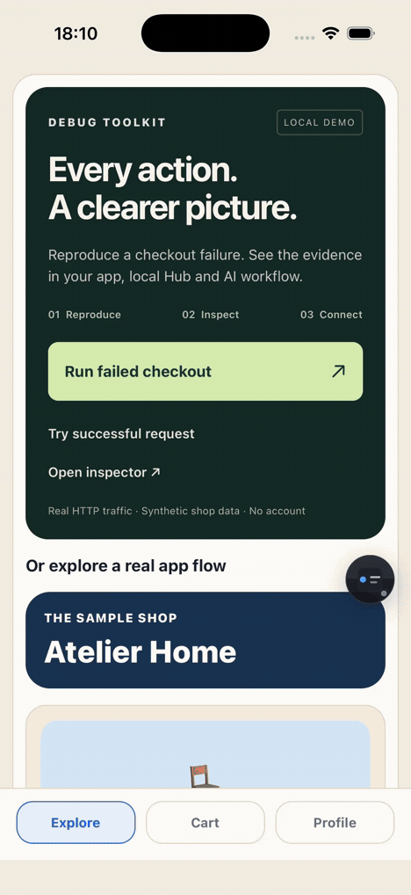
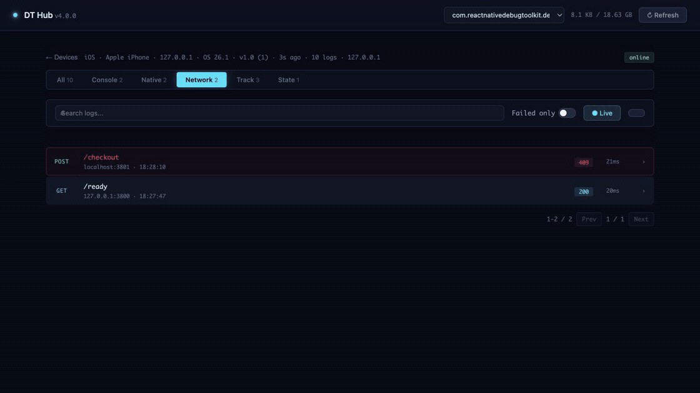

# React Native Debug Toolkit

**From an action in your app to the evidence behind it.**

[中文](README-zh-CN.md) · [Try the Demo](https://github.com/superzcj/react-native-debug-toolkit/blob/main/Demo/README.md) · [Integration guide](docs/integration.md) · [Configuration reference](docs/configuration.md)

A React Native debugging toolkit for development and internal builds: inspect HTTP requests and console logs in an in-app inspector, follow device activity in a local Web Console, and give AI coding assistants runtime evidence to investigate alongside your code.

Reproduce on the phone. Inspect on the desktop. Ask your AI what happened.

<p align="center"></p>

<p align="center"><sub>Requests, state, analytics events, environments, text sharing and log sync. About 18 seconds.</sub></p>

## Three ways to investigate

| Where you work             | What it gives you                                                                                                                            |
| -------------------------- | -------------------------------------------------------------------------------------------------------------------------------------------- |
| **Inside the app**         | A floating inspector keeps requests, console output and state changes close to the action. Check a failure while reproducing it on a device. |
| **In your browser**        | The local Hub collects device sessions. Search logs, expand request details and watch new events arrive while you operate the app.           |
| **With your AI assistant** | Read-only diagnostic commands provide runtime evidence for investigation; app integration follows the guides.                                |

No account or cloud log service required. The Hub runs on your computer.



**Bring device information to your computer:** app activity flows into the Hub. For a diagnostic note, enter text in Clip and tap Copy; view and copy it in the browser Console.

## Built for everyday debugging

| Capability                   | What you can inspect or control                                                                                                            |
| ---------------------------- | ------------------------------------------------------------------------------------------------------------------------------------------ |
| **Network**                  | Request status, timing, headers and request/response bodies from XMLHttpRequest and global fetch; text and JSON responses are inspectable. |
| **Console & Native**         | JS output and supported native logs in the same toolkit                                                                                    |
| **State**                    | Zustand actions and before/after values; explicit logging for other state systems                                                          |
| **Navigation**               | Route transitions, previous/next routes and timing                                                                                         |
| **Track / Analytics**        | Inspect instrumented event names, properties and timestamps to verify analytics tracking                                                   |
| **Custom tabs**              | Your app's own live snapshots: a cart, feature flags or user context                                                                       |
| **Environment switching**    | Switch configured development/test API hosts or URL prefixes and retain the selection                                                      |
| **Phone → Mac text sharing** | Send text through Clip/Copy to Console; view and copy it in the Mac browser Hub                                                            |
| **Quick actions**            | Long-press the floating launcher to run configured actions, such as switching environments or refreshing a page                            |
| **Log sync**                 | Send network, JS/native logs, state, navigation and analytics events to the local Hub, once or continuously                                |
| **Test accounts / Sessions** | Integrate account switching and revisit retained logs                                                                                      |

Network and console capture start automatically after initialization. State, navigation, events and business tools use small integrations. [See the integration examples and capture limits](docs/configuration.md)

## Find the evidence behind a bug

- **Inspect HTTP requests on a device:** see XHR/global fetch status, headers, timing, and text/JSON bodies in the Network panel or local Web Console.
- **Explain a state or navigation change:** connect a Zustand adapter, a navigation ref, or explicit events to inspect what changed alongside the request.
- **Check analytics events:** record event names and properties to verify what fired during a user action.
- **Give an AI assistant runtime logs:** use the local Hub and diagnostic CLI to inspect the same evidence alongside your source code. No AI API is called by the toolkit.

## Get started

### Add the in-app inspector

The documented integration path is React Native CLI. Expo Go is unsupported; Expo development builds, Expo Router, and legacy architecture are not yet verified. The declared RN version range is a candidate range, not a guarantee of native build compatibility. See the [support matrix](docs/integration.md#1-find-the-existing-root).

Install the package and native dependencies in your existing React Native CLI app:

```sh
npm install react-native-debug-toolkit@4.1.2 react-native-mmkv@4.3.2 react-native-nitro-modules@0.35.10 @react-native-clipboard/clipboard@1.16.3
cd ios
pod install
cd ..
```

Wrap your existing root component:

```tsx
import React from "react";
import { Text } from "react-native";
import { withDebugToolkit } from "react-native-debug-toolkit";

function App() {
  return <Text>My App</Text>;
}
export default withDebugToolkit(App);
```

The wrapper registers the default pages. Network, Console and Native capture after setup; State, Navigation, Track, Environment, Accounts and Custom stay empty until you provide a source, ref, event or real business data. Connect uses the native app identity automatically, so this example does not need an `appId`. [See the full configuration and examples](docs/configuration.md).

Rebuild the native app, then tap the floating launcher. The in-app inspector also works without a Hub. To choose Simplified Chinese, pass `withDebugToolkit(App, { locale: 'zh-CN' })`; omitted locale follows the device language.

### Connect your browser and AI assistant

From your app project, start the Hub:

```sh
npx --package=react-native-debug-toolkit@4.1.2 debug-toolkit hub dev
```

Open [localhost:3800](http://127.0.0.1:3800/). Debug builds discover the Hub through Metro and upload automatically; physical devices need a reachable LAN address for your computer.

To let an AI assistant investigate, optionally install the diagnosis Skill once:

```sh
npx --package=react-native-debug-toolkit@4.1.2 debug-toolkit init
```

Commit the generated `.agents/skills/react-native-debug-toolkit/SKILL.md` and `AGENTS.md` changes. In an assistant that can load them and reach the Hub, reproduce the problem and ask:

> Investigate why that checkout failed, using the runtime logs to locate the relevant code.

Toolkit supplies runtime evidence; your AI assistant does the analysis. App integration itself needs no Skill—follow the [integration guide](docs/integration.md). [Connection settings, build modes and troubleshooting →](docs/setup.md)

After reproducing the issue, retrieve machine-readable diagnostics:

```sh
npx --package=react-native-debug-toolkit@4.1.2 debug-toolkit diagnose --json
```

The response identifies available runtime evidence or the next step needed to collect it. Diagnostic commands read evidence; `hub dev` stores logs locally, and `init` installs the optional Skill. See the [diagnostic response example](docs/setup.md#minimal-ai-diagnosis-example).

## Try it with a real request

The [Demo](https://github.com/superzcj/react-native-debug-toolkit/blob/main/Demo/README.md) includes a local shop API. Trigger an inventory conflict, inspect the **HTTP 409 and JSON response**, follow the **state and analytics events**, switch to **Staging**, and watch **201 arrive in the Hub**. Use Clip to send a note to your computer. The data is synthetic; requests use the real React Native network stack.

Use in Debug and internal builds. Release is disabled by default; internal builds need explicit enablement and manual upload in Connect. Keep public production builds disabled. Run the Hub on a trusted network and review logs before sharing; they are not automatically redacted.

[MIT license](LICENSE)
